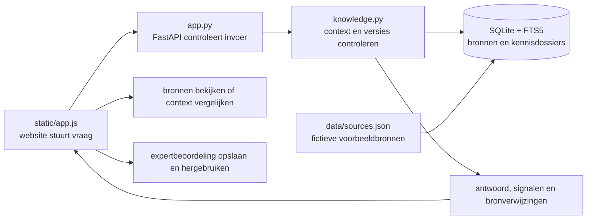

# PARALLAX — Kennis in perspectief

Hackathonprototype voor de SD Worx-uitdaging. PARALLAX helpt een medewerker te
zien waar een antwoord vandaan komt, voor welke context het geldt en waar
bronnen elkaar tegenspreken.

De voorbeeldinhoud is fictief. Ze is geen SD Worx-beleid of payrolladvies.

## Start de website

Vereist Python 3.10 of nieuwer en een SQLite-versie met FTS5.

```sh
python3 -m venv .venv
.venv/bin/python -m pip install -r requirements.txt
.venv/bin/python -m uvicorn app:app --host 127.0.0.1 --port 8000
```

Open daarna [http://127.0.0.1:8000](http://127.0.0.1:8000). De API-specificatie
staat op [http://127.0.0.1:8000/openapi.json](http://127.0.0.1:8000/openapi.json).
Om de server te stoppen, druk je op `Ctrl+C` in de terminal waar hij draait.

## Deploy op Google Cloud

Zie [de Cloud Run-handleiding](docs/deployment.md) voor de deploycommando's en
de beperkingen van deze gedeelde demo.

## Zo gebruik je de website

De website begint met één vraagveld. Typ je vraag of klik op het voorbeeld
**Deadline**, **Looncorrectie** of **Klantoverdracht**. Een voorbeeld voert de
vraag meteen uit; bij een eigen vraag klik je op **Zoek antwoord**.

De pagina volgt drie stappen:

1. **Je vraag:** land, klant en datum zijn vooraf ingevuld. Onder ‘Land, klant of
   datum aanpassen’ kun je ze wijzigen. De demo Acme-afspraak hoort bij België.
2. **Antwoord:** eerst verschijnt het resultaat. Als bronnen elkaar tegenspreken,
   toont de pagina bijvoorbeeld ‘dinsdag 12:00’ tegenover ‘woensdag 15:00’ en
   vraagt ze om bevestiging. Zo is direct duidelijk waarom er nog geen zeker
   antwoord is.
3. **Gebruikte bronnen:** onder het antwoord staan de documenten, met hun
   goedkeuringsstatus en een korte tekst. ‘Lees volledige bron’ opent alle
   informatie over het document.

Bij twijfel kies je **Vraag een beoordeling**. Je verzoek wordt lokaal opgeslagen.
Via **Beoordelingen** klap je **Beoordeling invullen** open. Daar kun je voor deze
demo een bron kiezen en je keuze motiveren.
Daarna kun je het beoordeelde antwoord opnieuw bekijken. De beoordeling wordt
alleen hergebruikt bij dezelfde vraag en context, zolang de bronnen niet veranderen.
Er worden geen echte experts gecontacteerd.

De extra mogelijkheden staan onder het antwoord:

- Klap **Vergelijk een ander land of een eerdere datum** open om dezelfde vraag
  in twee andere situaties te bekijken.
- Kies **Download antwoord en bronnen** om de onderbouwing te bewaren.
- Via **Bronnen** in het menu kun je alle fictieve documenten bekijken.

De interface toont geen bronnenkaart, lenzen of tellers meer. De hoofdpagina
blijft gericht op de vraag, het antwoord en de gebruikte bronnen.

## Hoe de website in elkaar zit



De browser toont de pagina uit `static/index.html`. De opmaak staat in
`static/style.css`; interacties staan in `static/app.js`. Deze bestanden gebruiken
geen externe lettertypen of CDN's. JavaScript verstuurt een vraag als JSON naar
de Python-server.

`app.py` is de FastAPI-laag: die valideert invoer, beperkt de aanvraaggrootte,
weigert ongewenste browseraanvragen en verbindt de website met de Pythonfuncties.
De routes zijn:

| Route | Doel |
| --- | --- |
| `POST /api/ask` | Beantwoord de vraag en bewaar een momentopname van de gevonden bronnen. |
| `GET /api/sources` | Toon het bronnenoverzicht. |
| `GET /api/assessments/{id}/compare` | Vergelijk dezelfde vraag met een ander land of een eerdere datum. |
| `GET /api/assessments/{id}/receipt` | Download het kennisdossier als Markdown. |
| `POST /api/reviews` | Leg een lokaal beoordelingsverzoek vast voor een momentopname. |
| `GET /api/reviews` | Toon open en afgeronde beoordelingsverzoeken. |
| `POST /api/reviews/{id}/resolve` | Leg een gemotiveerde demobeoordeling vast. |

`knowledge.py` zoekt met SQLite FTS5 in de bronpassages. De vraag wordt eerst
opgeschoond; waar een herkenbaar onderwerp, zoals een deadline, aanwezig is,
gebruikt de zoekfunctie de termen voor dat onderwerp. Land en klant worden al
tijdens de databasezoekopdracht toegepast. Daarna controleert de code datum,
opvolgende versies, bronhouder en formele goedkeuring. Elke controle blijft een
apart zichtbaar signaal; een goedgekeurde bron maakt een tegenspraak niet weg.

Conflicten worden vergeleken op claims die voor deze demo vooraf in
`data/sources.json` zijn gestructureerd. De code groepeert die claims op onderwerp
en vergelijkt gevonden actieve bronnen. Ook een afwijkende formulering kan een
conflict tonen als de bronnen dezelfde gestructureerde claim delen. Verschillende
landen, geldigheidsperioden en klantbereiken worden bij die vergelijking
meegewogen.

Een onderzoek wordt als momentopname met bronvingerafdruk opgeslagen. De beoordelingsfunctie
kan een gemotiveerde keuze koppelen aan die momentopname. Als de gebruikte bronnen
veranderen, vervalt de keuze automatisch. De export gebruikt de opgeslagen
momentopname, zodat een later gewijzigde bron het eerdere dossier niet herschrijft.

`model.py` bevat een optionele verbinding met een compatibele
chat/completions-provider. Zonder provider toont PARALLAX de gevonden tekst letterlijk.
Met een provider gebruikt het model alleen passages van een onderbouwd antwoord;
ongeldige verwijzingen of providerfouten leiden terug naar de oorspronkelijke
passages. Een juiste bronverwijzing bewijst op zichzelf niet dat een AI-antwoord
inhoudelijk klopt.

## Voorbeeldbronnen aanpassen

Pas `data/sources.json` aan. Elk document bevat onder meer een uniek `id`, een
`title`, `country`, een optionele `client_id`, een `owner`, `approved`, de
geldigheidsdatums, `supersedes`, tekstpassages en handmatig gestructureerde
`claims`. Deze velden bepalen wat in de interface verschijnt en welke
demo-conflicten gevonden kunnen worden.

De applicatie importeert dit bestand wanneer de database geen bronnen bevat. Stop
de server en maak een reservekopie voordat je de database verwijdert om de
bronnen opnieuw te importeren. Dezelfde database bevat ook dossiers en
beoordelingsverzoeken.

## Belangrijke grenzen

De demo analyseert geen willekeurige documenten automatisch op verborgen
tegenstrijdigheden. Alleen vooraf vastgelegde claims tellen mee in de
conflictcontrole. ‘Geen conflict gevonden’ betekent dus niet dat twee documenten
inhoudelijk met elkaar overeenstemmen. Zoeken op woorden en beperkte synoniemen
is ook geen semantische zoekfunctie.

De website heeft geen aanmeldscherm, rechtenbeheer of klantisolatie. De filters
op land en klant helpen de juiste kennis te vinden, maar beveiligen echte
bedrijfsgegevens niet. Gebruik daarom uitsluitend fictieve gegevens en start de
server alleen op localhost. Voor inzending is de Aikido AI Code Audit uit de
hackathongids nog vereist; deze lokale regressietests vervangen die audit niet.

## Tests

De tests gebruiken tijdelijke databases en een nagebootste modelrespons.
Installeer ook de testafhankelijkheid en voer alle regressietests uit:

```sh
.venv/bin/python -m pip install -r requirements-dev.txt
.venv/bin/python -m unittest discover -s tests -v
```

Tests staan in `tests/test_api.py`, `tests/test_knowledge.py` en
`tests/test_workflow.py`.

## Projectbestanden

| Bestand | Inhoud |
| --- | --- |
| `app.py` | Python-API en koppeling tussen website en kennisfuncties. |
| `knowledge.py` | Zoeken, controles, momentopnamen en beoordelingen. |
| `model.py` | Optionele AI-formulering met gecontroleerde bronverwijzingen. |
| `static/index.html` | Pagina-indeling van PARALLAX. |
| `static/style.css` | Kleuren, opmaak en schermformaten. |
| `static/app.js` | Vraag afhandelen en schermen bijwerken. |
| `data/sources.json` | De fictieve voorbeeldbronnen en demo-claims. |
| `docs/hackathon.md` | Aansluiting op de SD Worx-uitdaging en een kort videoscript. |
| `tests/` | Tests van zoeken, beveiligingscontroles en de beoordelingsflow. |
