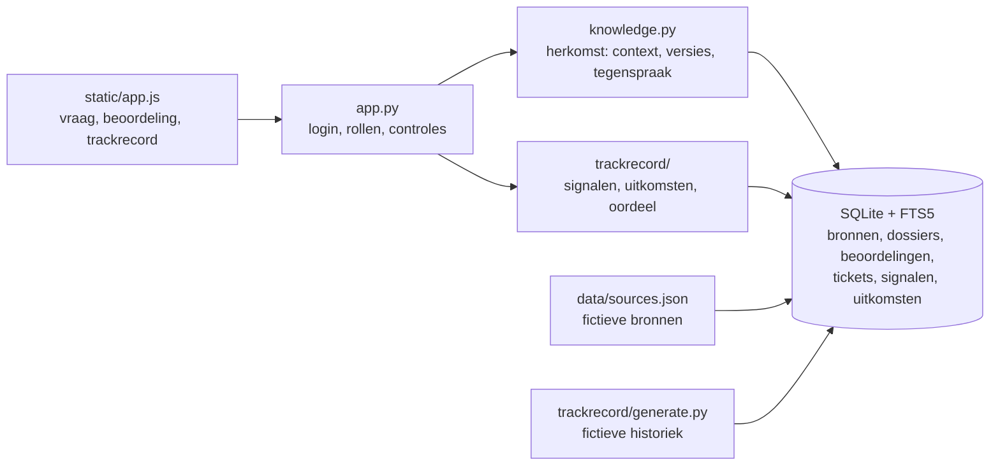

# PARALLAX — Kennis in perspectief, getoetst aan de praktijk

Hackathonprototype voor de SD Worx-uitdaging *Unlock the Knowledge Within*.
Team: Arthur Pintelon, Lamine Dene, Mauro Devolder, Nathaniel Lala.

PARALLAX helpt een payrollconsultant te zien **waar een antwoord vandaan komt**, **voor welke
situatie het geldt**, **waar bronnen elkaar tegenspreken** en **of een bron in de praktijk standhoudt**.

> Herkomst vertelt waarom je een bron zou geloven. Het trackrecord vertelt of dat terecht is.

Alle klanten, mensen, procedures en payrollregels zijn **fictief**. Ze zijn geen SD Worx-beleid of payrolladvies.

## Twee soorten vertrouwen

| | Vraag | Signalen |
|---|---|---|
| **Herkomst** | Mag ik deze bron geloven? | goedgekeurd, bronhouder, geldig op de datum, niet vervangen, geen tegenspraak |
| **Trackrecord** | Klopt ze ook in de praktijk, voor mijn situatie? | misgelopen na gebruik (heropend, gecorrigeerd, geëscaleerd), twijfel na het lezen, per situatie |

Elke bron krijgt uit haar trackrecord een oordeel:

| | Weinig misgelopen | Veel misgelopen |
|---|---|---|
| **Weinig twijfel na lezen** | Betrouwbaar | **Gevaarlijk**: vertrouwd, maar het loopt mis |
| **Veel twijfel na lezen** | Onduidelijk: herschrijven | Kapot: vervangen |

"Gevaarlijk" zie je niet aan een document. Het is goedgekeurd, klinkt overtuigend en niemand twijfelt. Alleen de uitkomsten achteraf tonen het.

## Start de website

Vereist Python 3.10 of nieuwer en een SQLite-versie met FTS5.

```sh
python3 -m venv .venv
.venv/bin/python -m pip install -r requirements.txt
.venv/bin/python -m uvicorn app:app --host 127.0.0.1 --port 8000
```

Open daarna [http://127.0.0.1:8000](http://127.0.0.1:8000). Bij de eerste start bouwt PARALLAX een
fictieve historiek van 12 maanden op: 1.580 tickets en 5.460 gebruikssignalen over 35 bronnen.

**Inloggen voor de demo:** gebruik `admin` met een **leeg wachtwoord**.

- Dat werkt alleen op je eigen computer: rechtstreeks via localhost en niet via een proxy of het netwerk.
- Rechtsboven kies je bij *Bekijk als* het perspectief van Sara (consultant), An (bronhouder) of Kim (kennisbeheerder).
- Admin handelt nooit als zichzelf. De regels van het gekozen perspectief gelden volledig.

De accounts `sara`, `an` en `kim` bestaan ook afzonderlijk. Hun wachtwoord staat na de eerste start in `data/demo-login.txt`, dat niet in git komt.

Om de server te stoppen druk je op `Ctrl+C`.

## Deploy op Google Cloud

Zie [de Cloud Run-handleiding](docs/deployment.md) voor de deploycommando's en
de beperkingen van deze gedeelde demo.

Online log je in als `admin` met het **teamwachtwoord** dat je bij het deployen instelt
(`PARALLAX_ADMIN_PASSWORD`). Het lege admin-wachtwoord werkt alleen lokaal. De `Dockerfile` vertrouwt de
proxy van Cloud Run (HTTPS, secure cookies) en laat de demoknoppen aan voor de kennisbeheerder.

## Zo gebruik je de website

**Sara, consultant: Vraag stellen**

1. **Je vraag.** Kies optioneel een ticket. Dat vult de vraag en de context in: klant, land, statuut. Zonder ticket stel je land, klant, statuut en datum zelf in. De voorbeelden *Deadline*, *Looncorrectie*, *Klantoverdracht* en *Vakantiegeld* werken zoals vroeger.
2. **Antwoord.** Als bronnen elkaar tegenspreken, toont PARALLAX de waarden naast elkaar, nu met het trackrecord van elke bron erbij. Is een goedgekeurde bron in jouw situatie vaak misgelopen, dan meldt de nieuwe status *Loopt vaak mis in de praktijk* dat. Met een ticket koppel je het antwoord aan dat ticket. De uitkomst van het ticket telt dan later mee.
3. **Gebruikte bronnen.** Per bron staan de goedkeuring en het trackrecord voor jouw situatie. *Lees volledige bron* toont alles. *Dit hielp niet* telt als twijfelsignaal.

Onder het antwoord kan je nog:
- een ander land, statuut of een eerdere datum vergelijken;
- antwoord en bronnen downloaden;
- een beoordeling vragen, met een optionele toelichting.

**An, bronhouder: Beoordelingen en Mijn bronnen**

- Bovenaan staan de verzoeken aan haar team. Bij het beoordelen ziet ze per bron hoe die het in de praktijk deed. Een eigen verzoek beoordelen kan niet (vier-ogenprincipe).
- Daaronder staan *Signalen uit de praktijk*: bronnen die opvallen, ook zonder dat iemand een verzoek deed.
- Het trackrecord van een bron toont:
  - waarom het oordeel zo is;
  - wanneer en waar het misloopt;
  - de oorzaak, uit een woordanalyse van mislukte tickets;
  - welke vragen lezers daarna stelden.
- An kan een **nieuwe versie** publiceren. In PARALLAX verschijnt de oude versie dan als *vervangen*, en een Teams-notitie kan ze mee opnemen. Het trackrecord begint opnieuw.

**Kim, kennisbeheerder: Overzicht**

- het raster twijfel × uitkomst;
- een prioriteitenlijst;
- ontbrekende kennis (onderwerpen waar mensen zoeken en niets vinden);
- de evaluatie;
- demoknoppen: *Simuleer volgende maand* en *Reset demo*.

### Het demoverhaal in één minuut

1. Sara werkt aan ticket T-DEMO-01: vakantiegeld voor een **arbeider**. De goedgekeurde procedure zegt "de werkgever betaalt", een niet-goedgekeurde Teams-notitie zegt "de vakantiekas". Het trackrecord laat zien dat de procedure bij arbeiders in 40 van de 57 gevallen misliep. De Teams-notitie liep 12 van de 12 keer goed af. **Goedgekeurd is niet hetzelfde als juist.**
2. Sara vraagt een beoordeling. An kiest met dat bewijs de notitie en publiceert versie 2 van de procedure, die de notitie opneemt.
3. Voor een **bediende** (T-DEMO-02) geldt dezelfde procedure wel: PARALLAX zegt er dan bij dat het probleem daar niet speelt.
4. Kim simuleert een maand: versie 2 bouwt een nieuw trackrecord op.

## Hoe het trackrecord rekent

Alles staat in [`trackrecord/scoring.py`](trackrecord/scoring.py). De AI beslist niets.

- **Gebruik.** Een bron die voor een ticket werd gebruikt. **Misgelopen** betekent: het ticket werd heropend, gecorrigeerd in de loonrun of geëscaleerd. Uitkomsten komen van het ticketsysteem en de loonrun, nooit uit de browser.
- **Twijfel na lezen.** Binnen 15 minuten na het lezen opnieuw zoeken, een andere bron openen, een beoordeling vragen of *Dit hielp niet* klikken. Korter dan 10 seconden lezen telt als vindbaarheidsprobleem.
- **Recentheid.** Recente gebruiken wegen zwaarder (halfwaardetijd 90 dagen). "De laatste 90 dagen" is ook een eigen situatie, zodat een regelwijziging opvalt.
- **Oordeel.** Scores worden afgevlakt naar een typische bron (de mediaan). Een oordeel komt pas vanaf 5 gebruiken door 5 verschillende collega's, en alleen als de kans op een echt hoge score (1,5 × typisch) minstens 90% is.
- **Situaties.** Per statuut, paritair comité, land, klantgrootte en periode zoekt PARALLAX waar een bron duidelijk vaker misloopt: minstens 15 procentpunt verschil, met 95% zekerheid.
- **Oorzaak.** Een woordanalyse van mislukte tickets: log-odds met een informatieve prior, z ≥ 1,96. Een taalmodel mag daar hoogstens één zin als hypothese van maken.
- **Integriteit.** Eén ticket telt één keer per bron, één persoon telt hoogstens 10 keer per maand mee, en er is één stem *Dit hielp niet* per versie.

## Werkt het? Gemeten, niet beweerd

Er is geen echte SD Worx-data, dus [`trackrecord/generate.py`](trackrecord/generate.py) bouwt fictieve werelden. In elke wereld zijn problemen verstopt ([`trackrecord/world.py`](trackrecord/world.py)):

- een bron die alleen voor arbeiders fout is;
- een onduidelijke bron;
- een kapotte bron;
- een bron die verouderd is na een regelwijziging op 1 juli;
- een kennislacune (flexi-jobs).

Resultaat op 20 werelden die niet gebruikt werden om de regels te ontwerpen (`python -m trackrecord.evaluate`, resultaat in `docs/evaluation.json`):

| | Resultaat |
|---|---|
| Geplante bronproblemen juist herkend | **67 / 80** (vakantiegeld 20/20, eindejaarspremie 20/20, loonbeslag 15/20, maaltijdcheques 12/20) |
| Valse alarmen op normale bronnen | **2 / 620** |
| Juiste situatie gevonden (arbeiders) | 20 / 20 |
| Kennislacune gevonden | 20 / 20, geen valse lacunes |
| Regelwijziging opgemerkt na | mediaan 42 dagen, gemist in 6 van 20 werelden |
| Zonder afvlakking en minimumbewijs | 213 / 620 valse alarmen |

Een recente regelwijziging is het moeilijkst: er zijn dan nog weinig afgeronde tickets. Loonbeslag wordt soms "gevaarlijk" genoemd in plaats van "kapot", omdat de twijfel dan net onder 90% zekerheid blijft. De demowereld (seed 8) is gekozen omdat alle patronen er zichtbaar zijn. De cijfers hierboven komen niet uit die wereld.

## Beveiliging en privacy

| Onderwerp | Maatregel |
|---|---|
| Authenticatie | Scrypt-wachtwoordhashes en server-side sessies. Cookie `HttpOnly`, `SameSite=Strict`, `Secure` op https, 8 uur geldig. Rate limiting op login. Geen user enumeration. |
| Admin-demoaccount | Een leeg wachtwoord werkt alleen via loopback zonder proxyheaders. `PARALLAX_DEMO_ADMIN=0` schakelt het uit, `PARALLAX_ADMIN_PASSWORD` vereist een wachtwoord. In de Dockerfile staat het uit. Admin kiest alleen tussen de drie demoperspectieven. |
| Autorisatie | Rollen per endpoint. Consultant: eigen portefeuille en eigen dossiers. Bronhouder: alleen het eigen team. Kennisbeheerder: kijken, niet beslissen of publiceren. |
| IDOR | Tickets, klanten, werksessies, kennisdossiers, beoordelingen en bronnen worden server-side gecontroleerd. Wie geen toegang heeft, krijgt een 404 zonder te horen of het object bestaat. |
| Businesslogica | Het vier-ogenprincipe bij beoordelingen. De context komt van het ticket. Een bron moet bij het ticket passen. Vervangen bronnen zijn niet meer bruikbaar. Uitkomsten zijn niet schrijfbaar vanuit de browser. Per ticket en per persoon gelden limieten, en een stem is uniek. |
| CSRF en browser | CSRF-token per sessie, controle op dezelfde origin, alleen JSON, maximaal 16 KB. Strikte CSP, `X-Frame-Options`, TrustedHost. Geen OpenAPI-endpoint. |
| Privacy | Signalen staan onder een HMAC-pseudoniem. Er bestaat geen endpoint met cijfers per persoon. Cijfers per situatie verschijnen pas bij ≥ 5 collega's. Rijksregisternummers, IBAN's, e-mailadressen en gsm-nummers worden uit vrije tekst verwijderd. |
| Model | Optioneel. Alleen https, geen redirects. Brontekst is data. Output wordt tegen een schema gecontroleerd en beïnvloedt nooit een score. |
| Geheimen | Niets in git. Het demowachtwoord en het pseudoniemgeheim worden lokaal gegenereerd (`chmod 600`). |

## Hoe de website in elkaar zit



| Route | Doel |
| --- | --- |
| `POST /api/login`, `/api/logout`, `GET /api/me`, `POST /api/act-as` | Aanmelden; admin wisselt van demoperspectief. |
| `POST /api/ask` | Beantwoord de vraag met herkomst en trackrecord; bewaar een momentopname. |
| `GET /api/tickets` | Open tickets in de eigen portefeuille. |
| `POST /api/events` | Leestijd, bron gebruikt voor een ticket, *Dit hielp niet*. |
| `GET /api/sources` | Bronnenoverzicht met trackrecord. |
| `GET /api/assessments/{id}/compare`, `/receipt` | Vergelijk situaties; download het eigen kennisdossier. |
| `POST /api/reviews`, `GET /api/reviews`, `POST /api/reviews/{id}/resolve` | Beoordelingen aanvragen, bekijken en (als bronhouder) beslissen. |
| `GET /api/track/sources`, `GET /api/track/sources/{id}`, `POST .../versions` | Trackrecord van de eigen bronnen; nieuwe versie publiceren. |
| `GET /api/overview`, `POST /api/demo/*` | Overzicht voor de kennisbeheerder; demoknoppen. |

## Voorbeeldbronnen aanpassen

Pas `data/sources.json` aan. Elke bron heeft onder meer:
- `id`, `title`, `country` en optioneel `client_id`;
- `statute` (`ALL`, `arbeider` of `bediende`) en `topic`;
- `owner` (het team van de bronhouder) en `approved`;
- de geldigheidsdatums, `supersedes` en tekstpassages;
- `claims`, handmatig gestructureerd.

Wie gebruikt wat, hoe vaak, en welke problemen verstopt zijn, staat in `trackrecord/world.py`. Bouw de demo opnieuw op met:

```sh
.venv/bin/python -m trackrecord.generate
```

## Belangrijke grenzen

- **Synthetische data.** Alle gebruikssignalen en uitkomsten zijn gegenereerd. Echte koppelingen met het ticketsysteem, de correcties van de loonrun of Teams zijn niet gebouwd. Het datamodel is er wel op voorzien.
- **Claims zijn vooraf vastgelegd.** Alleen vooraf vastgelegde claims tellen mee in de conflictcontrole. Een nieuw gepubliceerde versie heeft geen gestructureerde claims. "Geen conflict gevonden" betekent niet dat bronnen overeenstemmen.
- **Correlatie is geen oorzaak.** Het trackrecord toont een signaal met bewijs, een mens beslist. Bij *Simuleer volgende maand* nemen we aan dat een nieuwe versie het probleem oplost. In de praktijk is dat precies wat het trackrecord zou meten.
- **Eén serverproces.** Rate limiting zit in het geheugen van één proces. Er is geen SSO.
- **Geen vervanging voor de audit.** De verplichte Aikido AI Code Audit uit de hackathongids moet nog gebeuren. Deze tests vervangen die niet.

## Tests

```sh
.venv/bin/python -m pip install -r requirements-dev.txt
.venv/bin/python -m unittest discover -s tests -v
.venv/bin/python -m trackrecord.evaluate --seeds 20
```

74 tests, verdeeld over:
- `tests/test_knowledge.py` en `tests/test_workflow.py`: zoeken, versies, tegenspraak, beoordelingen;
- `tests/test_api.py`: de API-flow;
- `tests/test_security.py`: authenticatie, rollen, IDOR, businesslogica, privacy;
- `tests/test_trackrecord.py`: rekenregels, nieuwe versies.

## Projectbestanden

| Bestand | Inhoud |
| --- | --- |
| `app.py` | FastAPI-app: login, rollen, toegangscontrole, alle routes. |
| `knowledge.py` | Zoeken, context (land, klant, statuut, datum), versies, tegenspraak, dossiers en beoordelingen. |
| `model.py` | Optionele AI-formulering met gecontroleerde bronverwijzingen. |
| `trackrecord/scoring.py` | Rekenregels van het trackrecord en ontbrekende kennis. |
| `trackrecord/labels.py` | Wat een lezer naast een bron ziet, voor zijn eigen situatie. |
| `trackrecord/explain.py` | Oorzaak via woordanalyse, optioneel als AI-hypothese geformuleerd. |
| `trackrecord/generate.py`, `world.py` | Fictieve wereld en historiek met verstopte problemen. |
| `trackrecord/evaluate.py` | Evaluatie op niet-geziene werelden, met ablaties. |
| `trackrecord/auth.py`, `privacy.py`, `store.py` | Login en sessies, pseudoniemen en opkuis van persoonsgegevens, tabellen. |
| `static/` | Pagina, opmaak en interactie, zonder externe bestanden. |
| `data/sources.json` | De fictieve bronnen en demo-claims. |
| `docs/hackathon.md` | Aansluiting op de SD Worx-uitdaging en het videoscript. |
| `tests/` | Tests van alle bovenstaande. |
